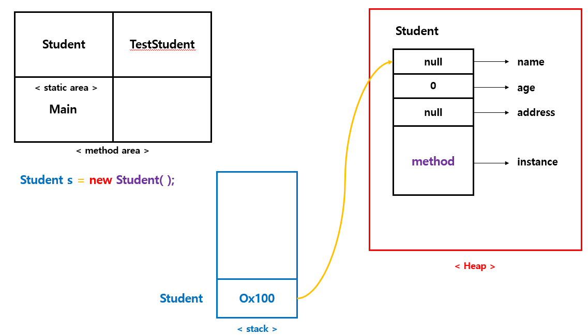
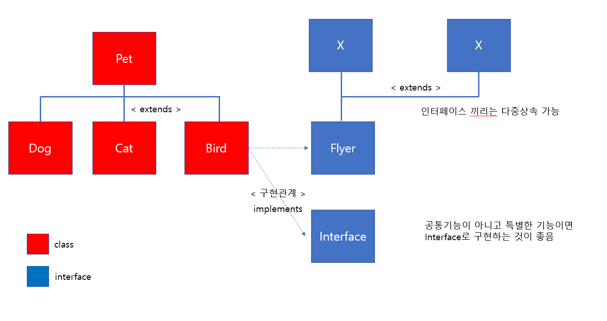

# hyundai-java
java-study

## Table of Contents

- [About The Project](#About-The-Project)
- [Data Type](#Data-Type)
- [Variable](#Variable)
- [Upcasting](#Upcasting)
- [Class](#Class)
- [Array](#Array)
- [1일차 최종정리](#1일차-최종정리)
- [Super](#Super)
- [Polymorphism](#Polymorphism)
- [Encapsulation](#Encapsulation)
- [Abstract](#Abstract)
- [Interface](#Interface)
- [Anonymous](#Anonymous)
- [2일차 최종정리](#2일차-최종정리)
- [Lambda](#Lambda)
- [Generics](#Generics)
- [Collection](#Collection)
- [Function Interface](#Function-Interface)
- [Stream](#Stream)
- [String](#String)

## About The Project

## Data Type

* 기본형 데이터 (8가지)
    - 수치형 
        + 정수형
            + byte (1byte)
            + short (2byte)
            + int (4byte)
            + long (8byte)
        
        + 실수형
            + float (4byte)
            + double (8byte) : 기본
            + 3.14 (double 처리)
            + 3.14F (float 처리)
            + 3.14D (double 처리)

    - 문자형
        + char (2byte) ===> '남', 'A'
        + escape 문자
            + \t : tab
            + \n : new line
            + \" : " output
            + \' : ' output
    + 논리형
        + boolean (1byte)
            + true
            + false (default)
* 참조형 데이터
    - 기본형 8가지 제외한 나머지 모두 참조형 대이터 
    - Class, Array, Interface


## Variable
* variable
    - object
        + data store
    
    - category
        + 기본형 변수 : 기본형 데이터를 저장한 변수
            + 변수에 가면 실제 기본 데이터가 저장되어 있음
        
        + 참조형 변수 : 참조형 데이터를 저장한 변수
            + 변수에 가면 실제 데이터가 저장된 주소 값이 저장되어 있다. 
            + 클래스,배열,인터페이스의 값의 주소값 저장되고 크기는 항상 4byte이다.
    
    - grammar
        + 변수 선언 : 메모리에 데이터를 저장할 영역만들고 영역에 이름 지정

        + 변수 초기화 

    - 선언 위치에 따른 변수 3가지 종류 (⁂⁂⁂⁂⁂)
        + local variable
            + 메서드안에서 선언된 변수
            + 메서드 호출시 생성 ~ 매서드 소멸시 제거
            + stack memory store
            + 사용전에 반드시 초기화 해야한다.
        + instance variable
            + 메서드 밖에서 선언된 변수
            + 객체생성(new) ~ 객체 소멸시 제거
            + heap memory store
            + auto init ( 정수: 0, 실수 : 0.0, 논리 : false, 참조형 : null)

        + class variable (static)
            + 메서드 밖에서 선언된 변수 + static
            + 프로그램 실행시 ~ 프로그램 종료시 제거
            + method area memory store
            + auto init (정수: 0, 실수: 0.0 , 논리:false,  참조형: null)

## Upcasting
* Upcasting
    - 데이터 종류가 변경 가능

    - 묵시적 형변환 (자동 형변환)
        + byte > short > int > long > float > double
        + char > int (ascii)
            + char값을 연산 가능하다.
        + int보다 작은 데이터형의 연산결과는 int로 반환

            ```
            short s = 10;
		    short s2 = 20;
		    short result = s+s2; //에러발생, s+s2의 결과는 int로 반환
		    int result2 = s + s2;
            ```
        + 작은타입과 큰타입 연산결과는 큰타입으로 반환
    
    - 명시적 형변환 (강제 형변환)
        + (데이터 타입) 변수
    
    ===========> 데이터 형변환은 기본형 뿐만 아니라 참조형도 가능 (클래스도 형변환 가능)
## Class
객체지향 프로그래밍 언어 ( Object Oriented Programming)

=> 객체 개념을 이용해서 프로그래밍 한다.

* Object?
    
    subject가 바라본 사물 의미

* 객체는 2가지 요소
    - 속성
        + 색상
        + 크기
        + 제조사
        + 가격..
    - 동작
        + on
        + off

* 자바 어플리케이션 개발 프로세스
    
    분석 --> 설계 --> 구현 --> 테스트 --> 배포
    - 분석 : 객체 추출 (어플리케이션 개발에 적합한 객체)
        + 학생관리 프로그램 개발
            + 학생객체
                + 속성 
                + 동작
            + 성적객체
            + 교사개체
    - 설계 : 분석단계에 추출한 객체를 클래스 표현
        + OOP 프로그래밍 : (현실세계 개념) ----------> (가상세계)

        + 학생객체 ----> Student 클래스 ----> 객체생성(new) ----> 인스턴스(홍길동 실제학생)
    - 구현
    
    - 테스트

    - 배포

* 용어정리 
    - 객체 : 현실세계의 사물의미
    - 클래스 : 객체의 자바문법의 표현방법 (틀, 설계도)
    - 인스턴스 : 메모리에 생성된 실체 (인스턴스, 객체)
                
                 
* 접근지정자 (access modifier)
    - 외부클래스에서 자신 접근 제약지정
        + public : 제약 X
        + protected
        + private : 자신만 접근
    
* this
    - 객체생성된 후 Heap Memory에 올라간 자신을 참조하는 키워드


## Array
* 변수
    - 값 하나만 저장 가능 -> 데이터 증가 -> 변수 증가
    - 사용방법
        + 변수선언
        + 초기화
    - 기본형
    
* 배열
    - 여러 데이터를 변수 (배열명) 하나로 관리 가능
    - 동일한 데이터만 관리
    - 사용방법
        + 배열 선언
        + 배열 생성
        + 초기화
    - 참조형 데이터 : 클래스, 배열, 인터페이스 무조건 생성부터(new 이용)

    - 배열 사용방법 3가지
        + new 이용
        + 초기값 이용 (new 없이)
        + 가+나 방법 혼합

    - java.util.Arrays 유틸리티 클래스
        + 정렬
        ```java
        Arrays.sort(names);
		System.out.println("1. 오름차순 정렬:");
		for (String s : names) {
			System.out.println(s);
		}
        ```
        + 배열값을 문자로 출력
        ```java
        System.out.println("2. 배열값을 한꺼번에 출력:" + Arrays.toString(names));
        ```
        + java.util.List 쉽게 생성하기
        ```java
        List<String> list = Arrays.asList("홍길동","이순신","유관순");  // ... 가변인자
		System.out.println("3. java.util.List 쉽게 생성하기:" + list);
        ```

## 1일차 최종정리


 
## Super

* 생성자 호출상태
    - 다른 클래스에서 객체생성시
        + new ClassName();
    - 자식클래스에서 부모 생성자 호출
        + super();
            + (자식클래스 생성자 첫 라인에 자동 삽입)
    - 같은 클래스의 특정 생성자에서 다른 생성자 호출
        + this();
    
    - 자식 입장에서는 기본 생성자를 기본적으로 호출한다 
        + 기본 생성자는 항상 만들어지기 때문에 기본적으로 기본 생성자를 호출한다.
        + 명시적으로 지정할시 반드시 첫라인에 사용해야된다.

* Object의 toString()
    - 참조변수를 println 할때 자동으로 호출된다.
        + 참조변수는 주소값이 저장되어 있음.
        + print하면 콘솔(console)에 문자열로 출력시키기 위해서 toString() auto call

    - Object의 toString 구현
        + return 클래스명 @16진수

    - 결론은 모든 사용자 정의클래스 Object의 toString 재정의하자
        + 명시적인 메서드 호출없이 원하는 객체 정보를 출력할 수 있다.    

* API
    - 시스템 제공한 클래스 의미 ===> 패키지로 제공
    - API 문서 : https://docs.oracle.com/javase/8/docs/api/index.html
    ```java
    Date d = new Date();
    System.out.println(d); // d.toString() 동일
    List<String> list = Arrays.asList("aa", "bb");
    System.out.println(list);
    ```

## Polymorphism
* 객체지향의 (OOP) 3대 특징
    - 상속 (inheritance)
    - 다형성 (Polymorphism)
    - 은닉화 (캡슐화, encapsulation)
* 다형성
    - 상속전제
    - 개념 : 하나의 변수가 서로 다른 데이터 타입을 참조하는 능력
    - 문법
        + 큰 타입 = 작은타입;
        + 부모클래스 타입변수 = new 자식클래스();
    - 단 하나의 변수로 여러 데이터 타입을 참조할 수 있다.

    ```java
    public static void main(String[] args) {

        // 1. 다형성 미적용
        Cat c = new Cat("나비", 2, "블랙");
        Dog d = new Dog("망치", 1, "수컷");


        // 2. 다형성 적용 ==> 하나의 변수로 모든 애완동물 참조 가능
        Pet pet = new Cat("나비",2,"블랙");
        System.out.println("고양이정보" + pet);
        pet = new Dog("망치", 1, "수컷");
        System.out.println("강아지정보" + pet);
    }
    ```
    ```java
    public static void main(String[] args) {

        // 1. 다형성 미적용
        Cat c1 = new Cat("나비1", 2, "블랙");
        Cat c2 = new Cat("나비2", 2, "블랙");
        Cat c3 = new Cat("나비3", 2, "블랙");
        Dog d1 = new Dog("망치1", 1, "수컷");
        Dog d2 = new Dog("망치2", 1, "수컷");
        Dog d3 = new Dog("망치3", 1, "수컷");

        Cat []  cats = {
                new Cat("나비1", 2, "블랙"),
                new Cat("나비1", 2, "블랙"),
                new Cat("나비1", 2, "블랙")};
        Dog []  dogs = {
                new Dog("망치1", 1, "수컷"),
                new Dog("망치1", 1, "수컷"),
                new Dog("망치1", 1, "수컷")};

        // 2. 다형성 적용 ==> 하나의 변수로 모든 애완동물 참조 가능
        /**
         * - 배열사용 : 다형성의 대표적인 샘플
         */
        Pet [] pets = {
                new Cat("나비1", 2, "블랙"),
                new Cat("나비1", 2, "블랙"),
                new Cat("나비1", 2, "블랙"),
                new Dog("망치1", 1, "수컷"),
                new Dog("망치1", 1, "수컷"),
                new Dog("망치1", 1, "수컷")
        };

        for (Pet pet  : pets){
            System.out.println(pet);
        }

        // 다형성 확장
        Object [] obj = {"홍길동", 20, new Date(), new Cat("나비1", 2, "블랙")};

        // 메소드 파라미터 - 다형성의 대표적인 샘플
        setData(20);
    }
    ```

    ```java
    public static void main(String[] args) {
        Pet [] pets = {
                new Cat("나비1", 2, "블랙"),
                new Cat("나비1", 2, "블랙"),
                new Cat("나비1", 2, "블랙"),
                new Dog("망치1", 1, "수컷"),
                new Dog("망치1", 1, "수컷"),
                new Dog("망치1", 1, "수컷")
        };

        // 1. 모든 애완동물 출력
        for (Pet pet: pets){
            System.out.println(pet);
        }
        System.out.println("/////////////////////");
        // 2. 고양이만 출력 ==> 고양이 타입인지 체크 필요,  instanceof
        for (Pet pet : pets){
            if(pet instanceof Cat){
                System.out.println("고양이 정보만 출력 :" +pet);
            }
        }

        // 3. 고양이의 정보중에서 색상만 출력
        for(Pet pet : pets){
            if(pet instanceof Cat){
                // Cat 형변환
                Cat cat = (Cat)pet;
                System.out.println("고양이 색상만 출력: " + cat.getColor());
            }
        }

    }
    ```
## Encapsulation
* 접근지정자 은닉화 구현
    - private : instance val
    - public : method
    - Student 입장에서 효율적 (올바른 데이터 설정)

* Method private
    - TestStudent 입장에서 효율적 (사용하지 않는 메서드 hide : 복잡성이 감소)

    ```java
    public class Student {

    // 1. 은닉화(Student입장) : 직접 접근하지 못하게 변수를 private 설정 ==> 올바른 데이터 설정  목적
    //
    private String name;
    private int age;

    // 검증 메서드
    private boolean ageCheck(int age){
        return age > 100;
    }

    public void setAge(int age){
        if(ageCheck(age)) {
            System.out.println("age 잘못설정");
        }
        else{
            this.age = age;
        }
    }
    }
    ```

## Abstract

* 추상메서드 (abstract method)
    - public abstract void methodName(); Signature 표현
    - 클래스는 반드시 abstract로 지정
    - 추상클래스 요소
        - 인스턴스 변수
        - 생성자
        - 일반 메서드 (인스턴스 메서드)
        - 추상 메서드 (abstract)
    - 추상 클래스를 상속받은 자식에서는 반드시 추상메서드를 재정의 해야한다.
        + 목적 : 자식클래스에서 꼭 사용하도록 강제한다.
    - 추상 클래스는 new 불가
    - 다형성 적용 가능
    - 여러 클래스에서 공통적인 메서드 사용하게 하자. (강제성 필요==> 추상클래스)

    ```java
    public static void main(String[] args) {
        Cat c = new Cat("나비", 2, "블랙");
        Dog d = new Dog("망치", 1, "수컷");

        System.out.println("고양이 정보 : "  + c);
        c.eat();
        c.sleep();
        System.out.println("강아지 정보 : " + d);
        d.dog_eat();
        d.dog_sleep();

        // method가 많아짐 비효율적 (Cat은 재정의 했지만 Dog은 나름대로 메소드 추가함)
        // 잘 따라주면 좋은데 안따라주는 것이 있다. -> 강제적으로 부모 메소드 기능 사용하도록
    }
    ```

## Interface
날아 다니는 기능 메서드 fly()는 어디에 추가할것인가?

* fly() 새로운 기능 추가방법
    - Pet 클래스 추가
        + fly 기능이 없는 Cat?

    - Bird 클래스 추가
        + fly()
        + Bird2() Class 생성시 ? 
        + 메소드가 많아 짐에 따라 비효율적 -> 공통적으로 강제해야함

    - Interface 

* 인터페이스 구성요소 4가지
    - 상수
        + public static final 자동 지정됨

    - 추상메서드 ( 주로 쓰는 이유 ⁂⁂⁂⁂)
        + public abstract 자동지정 -> 자동 지정 권장
    
    - default 메서드
        + 일반클래스 인스턴스 메서드 기능과 동일
    
    - static 메서드

* 추상클래스와 인터페이스 비교
    - 추상클래스 
        + public abstract class 클래스명{}
        
        + 구성요소
            + 인스턴스 변수, 생성자, 인스턴스 메서드 ---> 일반클래스 요소
            + 추상메서드 (abstract)
        + 특징
            + new 불가 (객체생성 불가)
            + 임의의 클래스 이용해서 추상클래스 요소로 사용됨
                + 임의의 클래스와 추상클래스 상속관계로써 extends 사용한다 ( 단일 상속만 지원)
        + 목적
            + 하위 클래스에서 특정 메서드만 사용하도록 강제 + 일반 클래스의 상속 (공통기능 재사용) 장점 제공
        + 단점
            + 다른 클래스를 상속불가 (하나만 받아야 하기 때문에 인터페이스로 받으면 여러개 받을 수 있는 장점이 있다.)
            + 특정 메소드만 강제할 목적이다 -> 인터페이스로 만드는게 좋다 (확장성이 좋기 때문에)
    - 인터페이스
        + public interface 인터페이스명{}
        + 구성요소
            + 상수, 추상메서드, default 메서드, static 메서드
        + 특징
            + 임의의 클래스 이용해서 인터페이스 요소로 사용됨
                + 임의의 클래스와 인터페이스 구현관계로서 implements 사용한다. (다중구현 가능)
            + 인터페이스간에 다중 상속 가능 (extends 사용)
        + 목적
            + 하위 클래스에서 특정 메서드만 사용하도록 강제 + 클래스들간의 의존성 감소(decoupling)

* DB 연동 아키텍처
    - Main <----> Service <----> DAO <----> DB(오라클, Mysql)
        + Main
            + 화면처리 + 사용자이벤트 발생 + 데이터출력 기능
        + Service 
            + 중간자 역할 + 트랜잭션 처리 (commit, rollback)
        + DAO
            + Datavase Access Object 패턴
                + 실제 DB, file 접근하는 용도
    - TestMain <----> DBService <----> OracleDAO <----> Oracle
        + MysqlDAO  <----> Mysql
            + 현재 문제 하나의 변경으로 인해 여러 영향을 미친다. (DBService 까지 영향 미침)
            + DB 변경시 DBService 변경 여파가 미친다.

* 인터페이스 이용한 의존성 감소


## Anonymous
* 중첩 클래스 (nested Class)
    
    ```java
    class Outer{
     ..
     ..
     ..
     class Inner{
     }//end Inner
    }
    ```

    + member inner class
    + local inner class
    + static inner class
    + 익명 클래스

* 익명 클래스 (Anonymous class)
    - 이름이 없는 클래스
    - 인터페이스 사용시 주로 익명클래스 사용됨 (가독성이 높아지기 때문에)

## 2일차 최종정리



## Lambda

* 함수형 프로그래밍 언어에 적합한 표현식. ( JDK 1.8)
    - 함수형 프로그래밍(functional Programming)
        + 함수 기반으로 프로그래밍을 하자.
        + 자바는 최소단위 클래스이다. ==> 따라서 하나의 메서드가 필요한 경우에도 반드시 클래스가 필요하다.
        + 불필요한 클래스를 배번 생성해야 하기 때문에 비효율성 증가 
        + 메서드만 집중해서 표현할 수 있는 람다식을 이용한다.
            + 실행하면 런타임때 익명클래스가 자동으로 생성된다.
        > java 는 A라는 메소드 사용하려면 최소 A를 감싸는 클래스를 만들어야 한다. 람다를 이용하면 A라는 것만 이용할 수 있다. 람다를 실행할때 익명 클래스가 만들어진다 겉으로 보여지진 않지만 클래스가 만들어지는 것이기 때문에 내부적으로는 최소 단위인 클래스를 이용한다고 볼 수 있다.

    - 람다식의 특징
        + 객체가 아닌 기능적인 코드(메서드)에 집중하자.
        + 간결한 표현식
        + **하나의 메서드를 가진 인터페이스 사용시 일반적으로 람다식이 사용된다.**
        + 특정 인터페이스가 하나의 추상메서드를 가지는 것을 강제할 방법으로 @FunctionalInterface 사용한다.

    - 람다식의 문법
        + 인터페이스를 활용한 익명클래스의 또 다른 표현식이라고 생각하자. 
        + 메서드의 기능에 따라서 람다식 표현이 달라진다. 
        + 메서드 문법
            ```java
            public returnType 메서드명([val1, val2..]){
                문장;
                [return 값;]
            }
            ```
        + 메서드 기능에 따른 종류 4가지
            - 파라미터 변수 없고 리턴값 없는 경우
            - 파라미터 변수 있고 리턴값 있는 경우
            - 파라미터 변수 없고 리턴값 있는 경우
            - 파라미터 변수 있고 리턴값 없는 경우
    - 람다표현 방법 (7가지)
    ```java
    public class LambdaTest {
    public static void main(String[] args) {

        // 1. 익명클래스
        Flyer flyer = new Flyer() {
            @Override
            public void fly() {
                System.out.println("익명클래스.fly");
            }
        };
        flyer.fly();

        //2. 람다 표현식 (arrow 표현식)
        Flyer flyer1 = () ->  {
            System.out.println("람다표현식.fly");
        };
        flyer1.fly();

        //2. 람다 표현식 ===> 단일 문장인 경우에는 {}생략가능
        Flyer flyer2 = () -> System.out.println("람다표현식.fly2");
        flyer2.fly();

        } //end main
    }//end class
    ```

    ```java
    public class LambdaTest2 {
    public static void main(String[] args) {

        // 1. 익명클래스
        Flyer2 fly = new Flyer2() {
            @Override
            public void fly(int n) {
                System.out.println("익명클래스 n = " + n);
            }
        };

        fly.fly(10);

        //2. 람다표현식
        Flyer2 fly2 = (int n) -> System.out.println("람다표현식 n = " + n);
        fly2.fly(20);

        //3. 람다표현식 ==> 데이터 타입 생략
        Flyer2 fly3 = (n) -> System.out.println("람다표현식 n = " + n);
        fly3.fly(30);

        //4. 람다표현식 ==> 파라미터변수가 하나인 경우에는 () 생략가능
        Flyer2 fly4 = n -> System.out.println("람다표현식 n = " + n);
        fly4.fly(40);

        }
    }
    ```

    ```java
    public class LambdaTest3 {

    public static void main(String[] args) {
        //1. 익명클래스
        Flyer3 f = new Flyer3() {
            @Override
            public void fly(int n, int n2) {
                System.out.println("익명클래스.fly"+ n + "\t" + n2);
            }
        };
        f.fly(10,30);


        //2.람다표현식
        Flyer3 f2 = (int n, int n2) -> System.out.println("람다표현식.fly" + n + "\t" + n2);
        f2.fly(10,20);

        //3. 람다표현식
        Flyer3 f3 = (n, n2) -> System.out.println("람다표현식.fly" + n + "\t" + n2);
        f3.fly(30,40);

        }
    }
    ```

    ```java
    public class LambdaTest4 {
    public static void main(String[] args) {

        //1.익명클래스
        Flyer4 fly = new Flyer4() {
            @Override
            public int fly() {
                return 6;
            }
        };
        System.out.println("익명클래스.fly" + fly.fly());

        //2. 람다 표현식
        Flyer4 fly2 = () -> {
            System.out.print("람다표현식.fly");
            return 999;
        };
        int result2 = fly2.fly();
        System.out.println(result2);

        //3. 람다표현식 // {} return 키워드 생략 가능
        Flyer4 fly3 = () -> 3;
        System.out.println("람다표현식3.fly" + fly3.fly());


    }
    }
    ```

    ```java
    public class LambdaTest5 {
    public static void main(String[] args) {

        //1. 익명 클래스
        Flyer5 f = new Flyer5() {
            @Override
            public int fly(int n, int n2) {
                return n + n2;
            }
        };


        System.out.println("익명클래스.fly" + f.fly(10,20));

        //2.람다 표현식
        Flyer5 f2 = (int n, int n2) -> { return n + n2; };
        System.out.println("람다표현식.fly" + f.fly(30,40));

        //3.람다표현식
        Flyer5 f3 = Integer::sum;
        System.out.println("람다표현식.fly" + f3.fly(80,40));
        }
    }
    ```
    
    ```java
    public class LambdaTest6 {
    public static void main(String[] args) {

        //1.기존방식
        String [] names = {"John", "Zen", "Ada", "Bob"};
        Arrays.sort(names);
        System.out.println("1.오름차순 정렬:" + Arrays.toString(names));

        //내림차순 정렬 ==> java.util.Comparator 인터페이스 활용

        Comparator<String> comparator = new Comparator<String>() {
            @Override
            public int compare(String o1, String o2) {
                return o2.compareTo(o1); // 내림차순 정렬
            }
        };

        Arrays.sort(names, comparator);
        System.out.println("2.내림차순 정렬:" + Arrays.toString(names));

        // 아래 방식과 같이 사용하는게 일반적
        Arrays.sort(names, new Comparator<String>() {
            @Override
            public int compare(String o1, String o2) {
                return o2.compareTo(o1); // 내림차순 정렬
            }
        });
        System.out.println("2.내림차순 정렬:" + Arrays.toString(names));

        Arrays.sort(names, (String o1, String o2) -> o2.compareTo(o1));
        System.out.println("3.내림차순(람다) 정렬:" + Arrays.toString(names));

        Arrays.sort(names, (o1, o2) -> o2.compareTo(o1));
        System.out.println("3.내림차순(람다) 정렬:" + Arrays.toString(names));


        }
    }
    ```
    ```java
    public class LambdaTest7 {
    public static void main(String[] args) {

        // 1. list 관리 ( 기존방식 )
        List<Person> list = Arrays.asList(new Person("홍길동",20), new Person("이하늘",29), new Person("김길동",31)
        , new Person("테스트",45), new Person("사람인",18));

        // 배열인 경우 ---> Arrays.sort();
        // 리스트인 경우 --> Collections.sort()

        list.sort(new Comparator<Person>() {
            @Override
            public int compare(Person o1, Person o2) {
                return o1.age - o2.age;
            }
        });

        System.out.println(list);

        // 2. 람다 표현식
        list.sort((o1, o2) -> o2.age - o1.age);
        System.out.println(list);
        }
    }
    ```

## Generics

* <T>, <?>, <? extends>, <? super 클래스 명>
    - 참조형만 가능 (기본형은 Wrapper 클래스로 사용)
        + 기본형
            - byte  =======================> Byte
            - short =======================> Short
            - int   =======================> **Integer**
            - long  =======================> Long
            - float =======================> Float
            - double=======================> Double
            - char  =======================> **Charter**
            - boolean =======================> Boolean
    
    - Case 1
        + 데이터 갯수만큼 setValue 추가된다 ==> 오버로딩 메서드 형태로 구현 ==> 비효율적
        ```java
        class Box{

        public void setValue(String string){

        }

        public void setValue(Date date) {

        }
        }
        public class GenericTest {
            public static void main(String[] args) {
                //1. 문자열 저장
                Box b = new Box();
                b.setValue("홍길동");

                Box b2 = new Box();
                b2.setValue(new Date());
            }
        }
        ```
    - case2
        + 문자열이 아닌 숫자를 넣어도 컴파일 에러가 발생되지 않는다.
        + 잘못된 데이터가 저장된 사실을 개발단계인 컴파일 시점이 아닌 실제로 실행되는 런타임 시점에 확인할 수 있다.
        ``` java
        public class GenericTest {
            public static void main(String[] args) {

                 Box b = new Box();

                 b.setValue("홍길동");

                 String str = (String)b.getValue(); //나. 반드시 형변환 필요
                 System.out.println("1." + str);

                 Box b2 = new Box();
                 b2.setValue(new Date());

                 Date d = (Date) b2.getValue();
                 System.out.println("2." + d);
            }
        }
        ```
    - case3
        + Object ---> T 로 변경. T는 Box 클래스를 생성할때 구체적인 타입으로 변경된다.
        + 잘못된 데이터가 저장된 사실을 개발단계인 컴파일시점이 아닌 실제로 실행되는 런타임 시점에 확인 할 수 있다.
        ```java
        class Box<T>{
            T obj;
            public void setValue(T obj){
                this.obj = obj;
            }
            public T getValue(){
                return obj;
            }
        }

        public class GenericTest {
        public static void main(String[] args) 
            Box<String> b = new Box<String>();
            b.setValue("홍길동");
            System.out.println("1." + b.getValue())
            Box<Date> b2 = new Box<Date>();
            b2.setValue(new Date());
            System.out.println("2." + b2.getValue())
            }
        }   
        ```
      
## Collection
* 자바의 저장 방법 3가지
    + 변수
        - 하나의 데이터 저장
        - 기본형 변수 & 참조형 변수
    + 배열
        - 여러 데이터 저장용
        - 참조형 변수
        - 특징 
            + 동일한 데이터만 저장 가능
            + 크기 변경불가
            + 접근시 인덱스(첨자)사용
            + 배열과 관련된 메서드가 없다. (Arrays 유틸리티 제외)
            + 배열크기 : 배열명.Length(상수)
            
    + 컬렉션 API
        - 여러 데이터 저장 가능
        - 참조형 변수 
        - 특징 
            + 모든 데이터 저장 가능
            + 크기 변경 가능 (추가, 삽입, 수정, 삭제)
            + 접근시 메서드를 사용
            + 다양한 메서드가 제공
            + 컬렉션 크기 : 변수명.size()
            + 문자열 길이 : String n = "hello"
                + n.length() (메서드)
    + 컬렉션 API 계층구조
        

        + Set 계열 : 저장되는 데이터의 순서가 없고 중복저장 불가 (동일한 값은 한번만 저장, 중복제거 기능 포함)
        + List 계열 : 저장되는 데이터의 순서가 있고 중복저장 가능
            + Set과 List는 데이터만 저장된다.
        
        + Map 계열
            + 데이터와 데이터에 해당되는 이름(Key) 쌍으로 저장된다.(Key/Value 쌍)
            + Key 이용해서 Value 얻는다. (검색속도가 빠름)

## Function Interface
* JDK 1.8지원
* java.util.function 패키지 포함되고 모두 interface로 구성됨
    - interface 사용할려면 
        + 이름있는 클래스
        + 익명 클래스
        + 람다 함수(****)
* **종류 5가지**
    - Consumer
        + Parameter o, Return x
    - Supplier
        + Parameter x, Return o
    - Function
        + Parameter o, Return o
        + **Mapping**
            + int -> String, String -> int, String->int 
    - Operator
        + Parameter o, Return o
        + 전달하는 파라미터를 연산해서 임의의 값으로 리턴하는 용도
        + **연산**
        + 내부적으로 Function 상속 받음
    - Predicate
        + Parameter o, Return o
        + 파라미터 있고 리턴값이 boolean 인 경우
    - 공통적으로 추상 메서드가 선언되어 있다.
    - 기능적으로 모든 메서드는 4가지 형태이다
        + Parameter x, Return x
        + Parameter x, Return o
        + Parameter o, Return x
        + Parameter o, Return o
        > 위 4가지 기능을 구현하고자 한다면 직접 클래스로 구현하지 말고 상위의 함수적 인터페이스를 이용하자.
        

## Stream

* Java I/O
    - InputStream
    - OutputStream
* Stream API
    - JDK 1.8 지원
    - Collection 저장된 데이터를 중간처리 최종처리를 할 수 있다
    - 중간처리 : ( 중복제거, 정렬, Skip,..) ==> 맵 (map)
    - 최종처리 : ( 총합, 최대값, 최소값, 갯수, ...) 가 가능하다. ==> 리듀스 (reduce) ==> 맵/리듀스
    - 함수형 인터페이스 API가 사용된다.
* Stream 타입 얻기
    - 컬렉션
    - 배열
    - 파일
* 종류
    - IntStream
    - LongStream
    - DoubleStream
* 중간처리
    - 중복제거
        + distinct()
    - 필터링
        + filter()
    - 정렬
        + sorted()
    - 개수제한
        + limit(n)
    - map()
        + 사용자 정의 중간처리
 * 최종처리
    - 총합
    - 개수
    - 최대/최소
    - collect()
 * Optional 클래스
    - 집계값이 존재하지 않을경우 예외가 발생한다.
    - 따라서 예외방지용으로 Optional 클래스를 사용할 수 있다.
 * method 사용시 간략한 표현 방법
    - static Method
    - instance Method

## String
* 값 또는 New 차이
    ```java
       // 1. 값만 이용 ==> 동일한 문자열은 재사용
       String s = "hello";
       String s2 = "hello";

       System.out.println("주소값 비교:" + (s == s2));
       System.out.println("실제값 비교:" + s.equals(s2));
       // 2. new 이용 ===> 매번 Heap 메모리에 생성
       String  x = new String("Hello");
       String x2 = new String("Hello");
       System.out.println("주소값 비교 : " + (x == x2));
       System.out.println("실제값 비교 : " + x.equals(x2));
    ```
* String 문법
    ```java
        String s = "Hello";
        System.out.println("1. 문자열 길이 : " + s.length());
        System.out.println("2. 특정문자 얻기 : " + s.charAt(0));
        System.out.println("3. 부분열 : " + s.substring(1));
        System.out.println("4. 부분열 : " + s.substring(1,s.length() -1 ));
        System.out.println("5. 특정문자위치: " + s.indexOf('e'));
        System.out.println("6. 특정문자위치: " + s.indexOf('X')); // 일치하는 문자 없으면 -1 반환
        System.out.println("7. 문자열연결: " + s.concat("~~~~"));
        System.out.println("8. 대문자: " + s.toUpperCase(Locale.ROOT));
        System.out.println("9. 소문자: " + s.toLowerCase(Locale.ROOT));
        System.out.println("10. 문자열 비교:" + s.equals("hello"));
        System.out.println("11. 문자열 비교:" + s.equalsIgnoreCase("hello"));
        System.out.println("12. 특정문자 포함여부: " + s.contains("H"));
        System.out.println("13. 특정문자 포함여부: " + s.contains("h"));
        System.out.println("14. 문자열 치환: " + s.replace('H', 'Z'));

        String s2 = "     world     ";
        System.out.println("15. 공백제거: " + s2.trim()); // 양쪽 공백제거
        System.out.println("15. 공백제거: " + s2.trim().length()); // 5

        char [] chs = s.toCharArray();
        System.out.println("16. 문자배열: " + Arrays.toString(chs));

        // 구분자 분리
        String s3 = "aaa/bbb/ccc";
        String [] strArr = s3.split("/");
        System.out.println("17. 구분자 분리: " + Arrays.toString(strArr));

        String xyz = s.replace('H','X');

        System.out.println(s);
        System.out.println(xyz);

        // 원본
        System.out.println(s);
    ```
> String 가장 큰 특징은 변경 불가 따라서 다양한 메서드로 처리하면 새로운 문자열이 매번 생성된다. StringBuffer/StringBuilder => 자신이 변경됨 => 메모리 관리 효율적.
